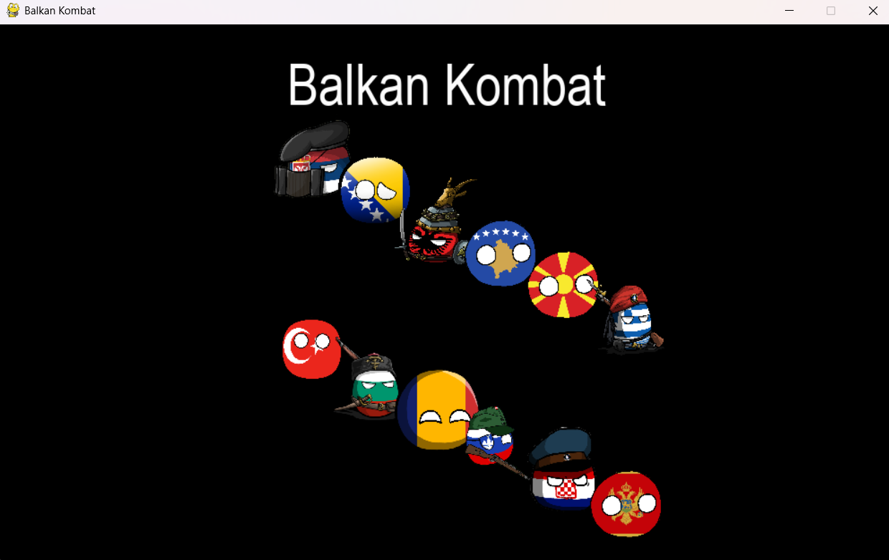

# Balkan Kombat
This is my second silly game I have ever made. It's a political incorrect and AGAIN a really dumb game.
This magnificient relaxing THING was created in Python (now you can laugh on me 🤣).

## General description
Currently you can play only in Multiplayer mode (becaues I'm too lasy to do single mode). It's a 2D game however the graphical stuffs aren't mine I stole them....

Now you can choose two players in the game and you can shoot each other with stereotypical weapons - for instance, Romania can shoot with Ceausescu.
Also each players have 5-5 HP in each rounds and in the end of third round the winner will be announced. If you beat your opponent by 2:1 or 3:0, the formula is simple: you win.

## Blyatiful image

## Good news
> [!NOTE]  
> Finally I created single player mode

> [!WARNING]
> But my code still sucks...

